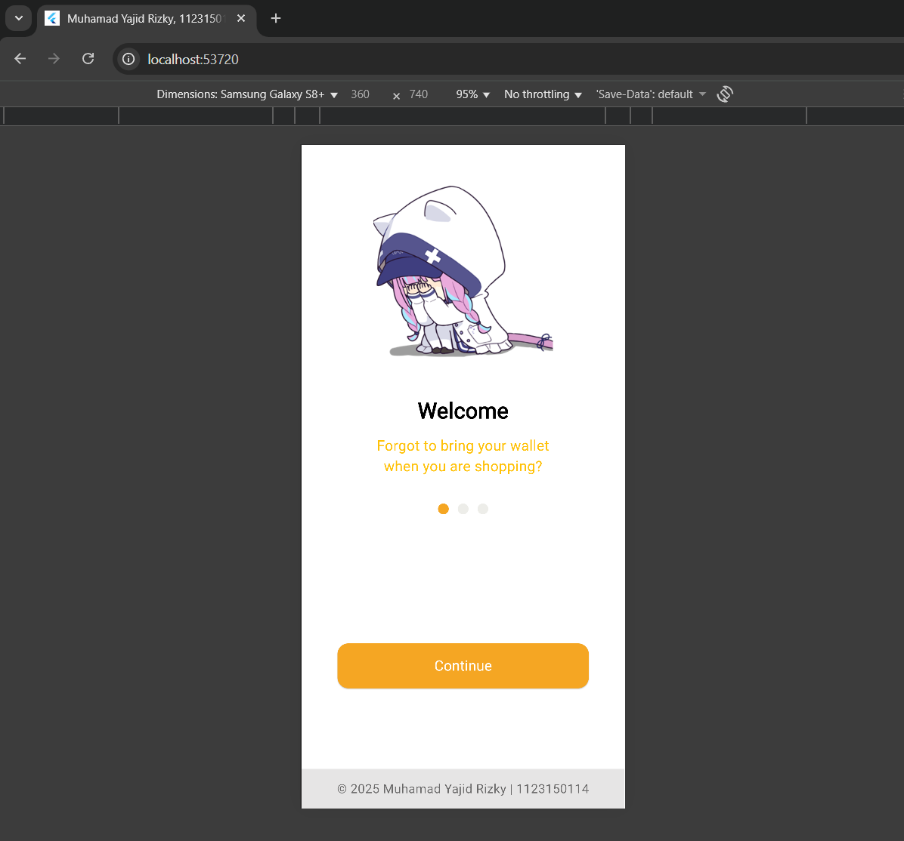
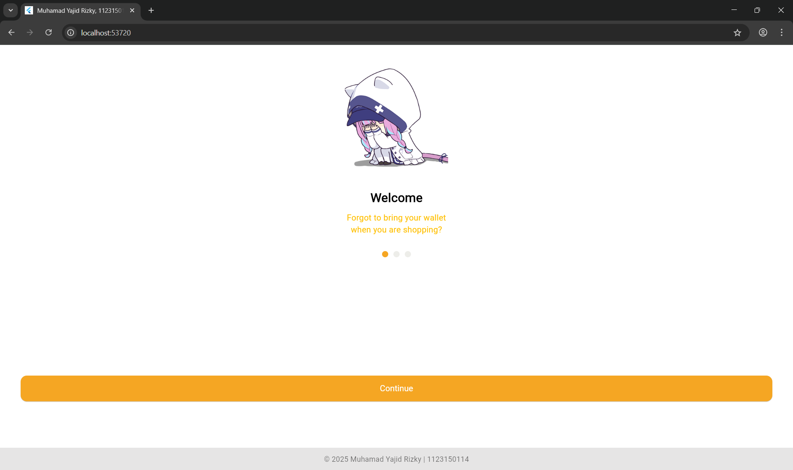
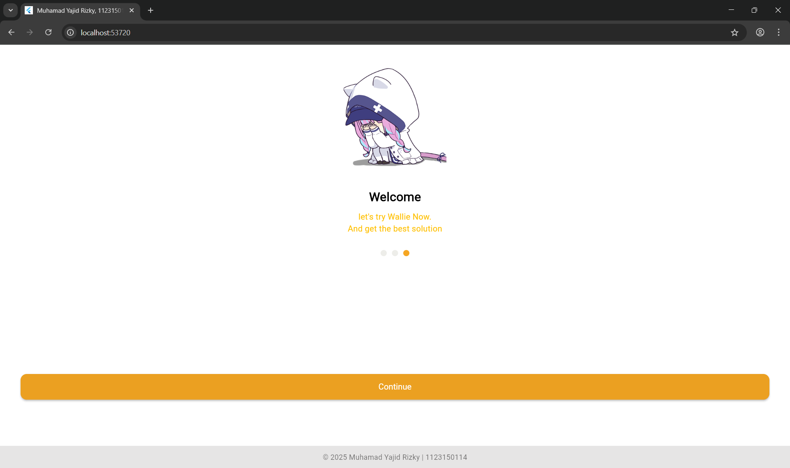
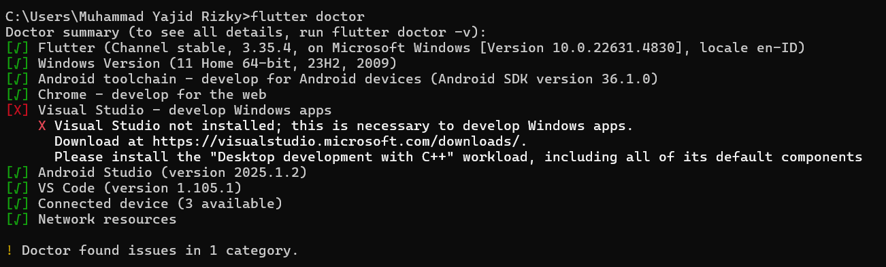

# UTS Flutter Project

## Hasil Screenshot
Berikut hasil tampilan aplikasi:

### Tampilan Mobile



### Tampilan Desktop





---

## Nama Lengkap
**Muhamad Yajid Rizky**

## NIM
**1123150114**

---

## Cara Menjalankan Project
1. Lakukan **git clone** pada repository berikut:
   ```bash
   git clone https://github.com/Frientia/KBI1179-1123150114-uts.git
2. Buka hasil clone di code editor (misalnya VS Code atau Android Studio).
3. Buka terminal dan pastikan sudah menginstal dependency seperti berikut:  
   
4. Jika dependency sudah sesuai dengan yang di atas, jalankan perintah berikut di terminal:
   ```bash
   flutter pub get
   flutter run


### Terima Kasih
